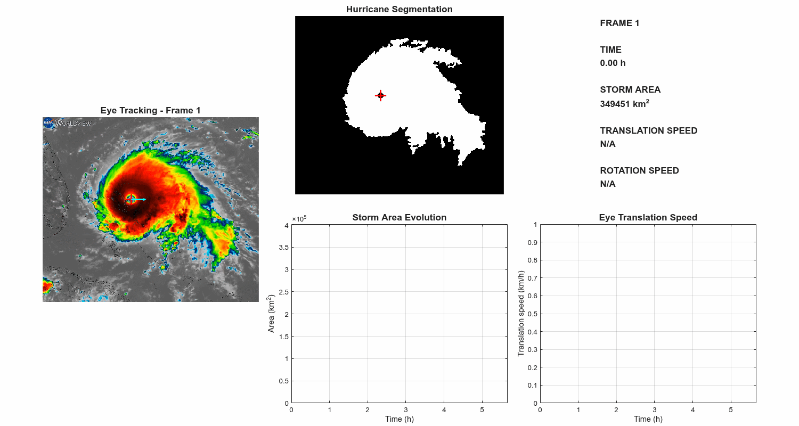
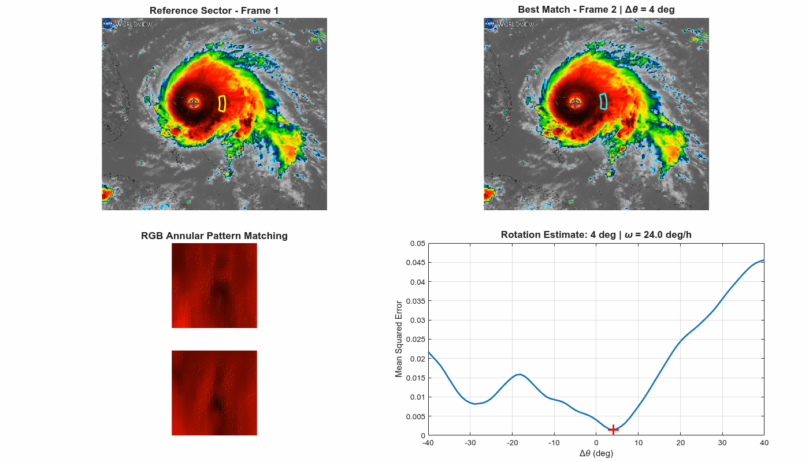
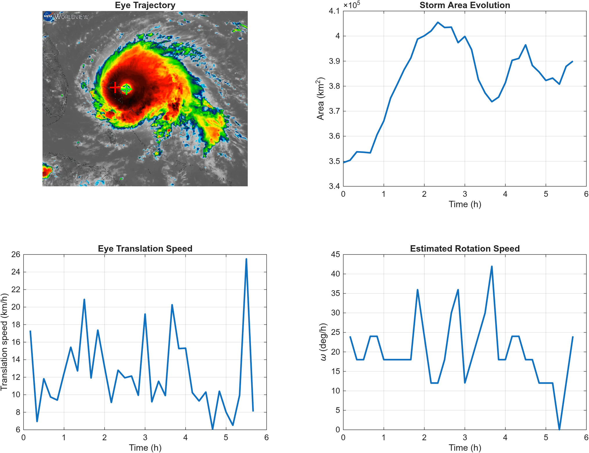

# Hurricane Dorian Motion Analysis

**Scientific image processing of Hurricane Dorian from a time-resolved RGB satellite sequence.**  
The project segments the cloud structure, tracks the eye, measures its translational motion, and estimates local angular rotation from RGB texture matching in an annular sector.

<p align="center">
  
</p>

## Scientific objective

The input is a sequence of **35 RGB satellite frames**, separated by **10 min**. From these images, the analysis estimates four quantities:

1. the segmented area of the visible cloud structure, $A(t)$,
2. the trajectory of the hurricane eye, $\mathbf{r}_{\mathrm{eye}}(t)$,
3. the eye translation velocity, $v(t)$,
4. a local angular velocity, $\omega(t)$, inferred from the apparent displacement of cloud texture between consecutive frames.

The problem is interesting because the cloud field is **not a rigid body**: it translates, rotates and deforms simultaneously. The approach therefore separates the analysis into a global segmentation/tracking stage and a local texture-matching stage for rotation.

> **Scope.** This is an image-based physical analysis, not a meteorological forecast. The segmented cloud area is not the same quantity as the operational hurricane wind-field area, and the estimated angular velocity is a local image-texture proxy rather than a direct wind-speed measurement.

---

## Dataset and calibration

| Parameter | Value |
| --- | ---: |
| Number of frames | 35 |
| Time between frames | 10 min = $1/6$ h |
| Total observed interval | 5 h 40 min |
| Spatial scale used in the analysis | 1 km/pixel |
| Image representation | RGB, with HSV used for segmentation |

With the adopted spatial scale $s=1\,\mathrm{km/pixel}$, each segmented pixel contributes

$$
A_{\mathrm{pixel}} = s^2 = 1\,\mathrm{km^2}.
$$

The time interval is

$$
\Delta t = \frac{10}{60}\,\mathrm{h} = \frac{1}{6}\,\mathrm{h}.
$$

Therefore, a displacement of one pixel between consecutive frames corresponds to 1 km over 10 min.

---

## Processing pipeline

```text
RGB frame
   │
   ├──► RGB → HSV → saturation threshold
   │          │
   │          └──► morphology + largest connected component
   │                       │
   │                       ├──► cloud mask → area
   │                       │
   │                       └──► interior holes → eye candidate
   │                                      │
   │                                      └──► temporal eye tracking → translation
   │
   └──► eye-centered annular RGB sector
                    │
                    └──► angular scan + MSE minimization → rotation
```

---

# 1. Color-based segmentation

## Why HSV?

The satellite frames contain a strongly colored hurricane structure over a comparatively desaturated background. For segmentation, it is therefore useful to separate **color saturation** from brightness and hue.

Each RGB frame is transformed to HSV and only the saturation channel $S(x,y)$ is used to create the initial binary mask:

$$
M_0(x,y) =
\begin{cases}
1, & S(x,y) > 0.4,\\
0, & S(x,y) \le 0.4.
\end{cases}
$$

The threshold $S>0.4$ was selected to isolate the central cloud system while rejecting most of the low-saturation background.

## Morphological cleanup

The raw threshold contains small discontinuities and isolated structures. A disk-shaped structuring element of radius **3 pixels** is used for morphological closing and opening:

$$
M_1 = (M_0 \bullet B) \circ B,
$$

where $\bullet$ denotes closing, $\circ$ denotes opening, and $B$ is the disk structuring element.

Conceptually:

- **closing** connects nearby parts of the cloud structure and fills small gaps,
- **opening** suppresses small isolated features,
- retaining the **largest connected component** removes unrelated colored regions.

The result is a compact binary representation of the main visible cloud structure.

---

# 2. Eye detection and temporal tracking

The eye appears as an interior hole in the segmented cloud structure. The mask is first hole-filled, producing a new mask $F(M_1)$. The interior holes are then isolated as

$$
H = F(M_1) \land \neg M_1.
$$

Here $H$ contains only the interior gaps of the segmented cloud system.

## Initial eye detection

In the first frame, the largest connected component of $H$ is selected as the eye. Its centroid is

$$
\mathbf{c}_1 = (x_1,y_1).
$$

## Tracking in subsequent frames

For frame $k>1$, each interior hole provides a candidate centroid $\mathbf{c}_{k,j}$. The selected eye is the candidate with minimum Euclidean distance to the previous eye position:

$$
j^* = \arg\min_j \|\mathbf{c}_{k,j}-\mathbf{c}_{k-1}\|_2.
$$

The tracked eye centroid is then

$$
\mathbf{c}_k = \mathbf{c}_{k,j^*}.
$$

This nearest-centroid rule introduces temporal information without requiring a learned detector or a full optical-flow tracker.

After the eye has been identified, the other internal holes are filled so that the area measurement refers to one homogeneous cloud structure with the eye excluded.

---

# 3. Cloud-area estimation

If the final binary mask in frame $k$ contains $N_k$ white pixels, then

$$
A_k = N_k s^2.
$$

With $s=1\,\mathrm{km/pixel}$, this reduces numerically to

$$
A_k = N_k\,\mathrm{km^2}.
$$

The analysis gives

$$
A_{\min} = 349451\,\mathrm{km^2},
$$

$$
A_{\max} = 405507\,\mathrm{km^2}.
$$

The range of the segmented visible cloud structure is therefore

$$
\Delta A = A_{\max}-A_{\min} = 56056\,\mathrm{km^2}.
$$

This quantity should be interpreted as the area of the **segmented cloud structure under this image-processing criterion**, not as the area enclosed by a specific meteorological wind threshold.

---

# 4. Eye translation

Let the eye centroid in consecutive frames be

$$
\mathbf{c}_{k-1} = (x_{k-1},y_{k-1}),
$$

$$
\mathbf{c}_{k} = (x_k,y_k).
$$

The inter-frame displacement in pixels is

$$
d_k = \sqrt{(x_k-x_{k-1})^2 + (y_k-y_{k-1})^2}.
$$

Including the spatial calibration $s$, the physical displacement is

$$
\Delta r_k = s\,d_k.
$$

The translation velocity is therefore

$$
v_k = \frac{s}{\Delta t}
\sqrt{(x_k-x_{k-1})^2 + (y_k-y_{k-1})^2}.
$$

For this dataset, $s=1\,\mathrm{km/pixel}$ and $\Delta t=1/6\,\mathrm{h}$, so

$$
v_k = 6\sqrt{(x_k-x_{k-1})^2 + (y_k-y_{k-1})^2}\,\mathrm{km/h}.
$$

The measured mean translation velocity is

$$
\bar{v} = 12.36\,\mathrm{km/h}.
$$

---

# 5. Rotation from annular RGB pattern matching

Estimating rotation is the least direct part of the problem. A global rigid-image rotation is not appropriate because the hurricane translates and the cloud field deforms. Instead, the algorithm compares a **local annular sector centered on the tracked eye**.

## Sampling geometry

The reference sector is defined by

$$
140 \le r \le 170\,\mathrm{pixels},
$$

$$
-15^\circ \le \theta \le 15^\circ.
$$

For a tracked eye center $(x_c,y_c)$, polar samples are mapped to image coordinates using

$$
x = x_c + r\cos\theta,
$$

$$
y = y_c - r\sin\theta.
$$

The minus sign in the second equation accounts for the image coordinate system, where the vertical pixel coordinate increases downwards.

The sampled RGB pattern can be written as

$$
P_k(r,\theta,c),
$$

where $c \in \{R,G,B\}$.

Because the sector contains 31 radii, 31 angles and 3 color channels, each comparison uses

$$
31\times31\times3 = 2883
$$

scalar RGB values.

## Angular search

Candidate angular shifts are tested over

$$
\Delta\theta \in [-40^\circ,40^\circ]
$$

in steps of $1^\circ$.

For each candidate shift, the current-frame pattern is sampled at $\theta+\Delta\theta$ and compared with the previous-frame reference pattern using the mean squared error

$$
E_k(\Delta\theta) =
\frac{1}{N}
\sum_{r,\theta,c}
\left[P_{k-1}(r,\theta,c)-P_k(r,\theta+\Delta\theta,c)\right]^2.
$$

The estimated angular displacement is the value that minimizes this error:

$$
\widehat{\Delta\theta}_k = \arg\min_{\Delta\theta} E_k(\Delta\theta).
$$

In the idealized limit of a perfectly rigidly rotating pattern, the correctly shifted patterns would coincide and the minimum error would approach zero. Real clouds evolve between frames, so the minimum is non-zero and the method should be interpreted as finding the **most similar local texture alignment**.

<p align="center">
  
</p>

## Angular velocity

The corresponding angular velocity is

$$
\omega_k = \frac{\widehat{\Delta\theta}_k}{\Delta t}.
$$

Since $\Delta t=1/6\,\mathrm{h}$,

$$
\omega_k = 6\,\widehat{\Delta\theta}_k\,\mathrm{deg/h}.
$$

The mean estimated angular velocity across the sequence is

$$
\bar{\omega} = 20.12\,\mathrm{deg/h}.
$$

The integer-degree angular scan implies a native angular-velocity quantization of

$$
6\,\mathrm{deg/h}
$$

for each individual frame-to-frame estimate. A finer angular search or interpolation around the MSE minimum would reduce this discretization.

The cumulative orientation used in the tracking visualization is updated as

$$
\phi_k = \phi_{k-1} + \widehat{\Delta\theta}_k.
$$

---

## Main results

| Quantity | Result |
| --- | ---: |
| Frames analyzed | 35 |
| Observation interval | 5 h 40 min |
| Mean eye translation velocity | **12.36 km/h** |
| Mean estimated angular velocity | **20.12 deg/h** |
| Minimum segmented cloud area | **349,451 km²** |
| Maximum segmented cloud area | **405,507 km²** |
| Area range | **56,056 km²** |

<p align="center">
  
</p>

---

## Why use RGB for the rotation stage?

Segmentation benefits from HSV because saturation separates the cloud system from the background. Rotation estimation has a different objective: it needs as much local texture information as possible.

The annular matcher therefore works directly with all three RGB channels. Keeping the color information provides a richer pattern than a single grayscale or binary representation and makes the local cloud structures easier to distinguish during the angular scan.

This illustrates an important design choice in image processing: **the most useful image representation depends on the task**. HSV is useful for separating regions; RGB is useful here for comparing local appearance.

---

## Interpretation and limitations

The approach is deliberately transparent: every estimated physical quantity can be traced back to an explicit image-processing operation. That makes it useful as a scientific-computing project, but it also introduces several limitations.

### Segmentation

The threshold $S>0.4$ is fixed for all frames. Changes in image color mapping, illumination or satellite product could require a different threshold. Morphological operations also modify the boundary by a few pixels, which propagates into the measured area.

### Eye tracking

Nearest-centroid association assumes that the true eye candidate remains close to its previous position. It does not explicitly model velocity, acceleration, appearance or uncertainty.

### Area

The measured area is determined by the segmentation criterion and the adopted 1 km/pixel calibration. It is **not** equivalent to the meteorological size of the hurricane defined from wind-speed contours.

### Rotation

The cloud field is non-rigid: features can shear, grow, disappear or change brightness between frames. Consequently, the MSE minimum represents the best local match, not exact material rotation. Repeated cloud textures can also produce secondary minima.

The current search uses integer angular steps. Sub-degree interpolation around the minimum could provide a smoother estimate.

### Uncertainty

The present version reports deterministic estimates but does not yet propagate uncertainties from segmentation, centroid localization, spatial calibration or angular matching. Adding uncertainty bands would be a natural extension of the analysis.

---

## Possible extensions

Several improvements would turn the current interpretable pipeline into a more complete motion-analysis study:

- sub-pixel eye localization,
- Kalman filtering or another dynamical eye tracker,
- adaptive or learned segmentation,
- sub-degree interpolation of the MSE minimum,
- comparison with optical flow,
- several annular sectors at different radii to estimate differential rotation,
- uncertainty propagation and confidence intervals,
- sensitivity analysis with respect to the HSV threshold and annulus geometry,
- comparison of RGB matching with grayscale, normalized correlation and feature-based registration.

A particularly interesting extension would be to estimate

$$
\omega = \omega(r,\theta,t),
$$

rather than a single local angular displacement per frame pair, allowing the non-rigid rotation of different cloud bands to be studied explicitly.

---

## Repository structure

```text
Dorian-Hurricane/
├── README.md
├── run_analysis.m
├── src/
│   ├── segment_hurricane.m
│   ├── detect_eye.m
│   ├── estimate_rotation.m
│   ├── render_tracking_frame.m
│   ├── render_rotation_frame.m
│   ├── append_gif_frame.m
│   └── render_summary.m
├── data/
│   ├── README.md
│   └── frames/
│       ├── Frame_1.png
│       ├── Frame_2.png
│       └── ... Frame_35.png
├── assets/
│   ├── tracking.gif
│   ├── rotation.gif
│   └── summary.png
└── .gitignore
```

## Running the analysis

Open MATLAB in the repository root and run

```matlab
run_analysis
```

The script processes the complete sequence and regenerates

```text
assets/tracking.gif
assets/rotation.gif
assets/summary.png
```

## Requirements

- MATLAB
- Image Processing Toolbox

Main Image Processing Toolbox functions used include `rgb2hsv`, `strel`, `imclose`, `imopen`, `bwareafilt`, `imfill`, `bwlabel` and `regionprops`.

## Data note

The repository contains the 35 frames used to reproduce the analysis. The source images carry **NASA Worldview** branding. They are included here as the input data for this scientific image-processing exercise; this repository does not claim ownership of the source imagery.
